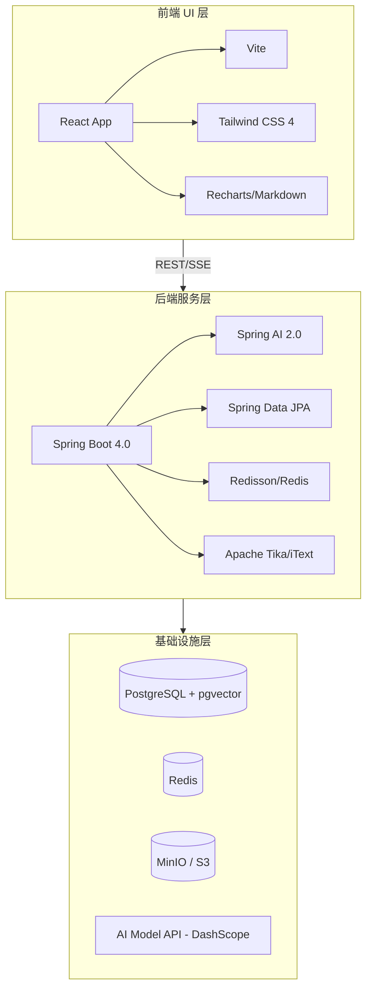
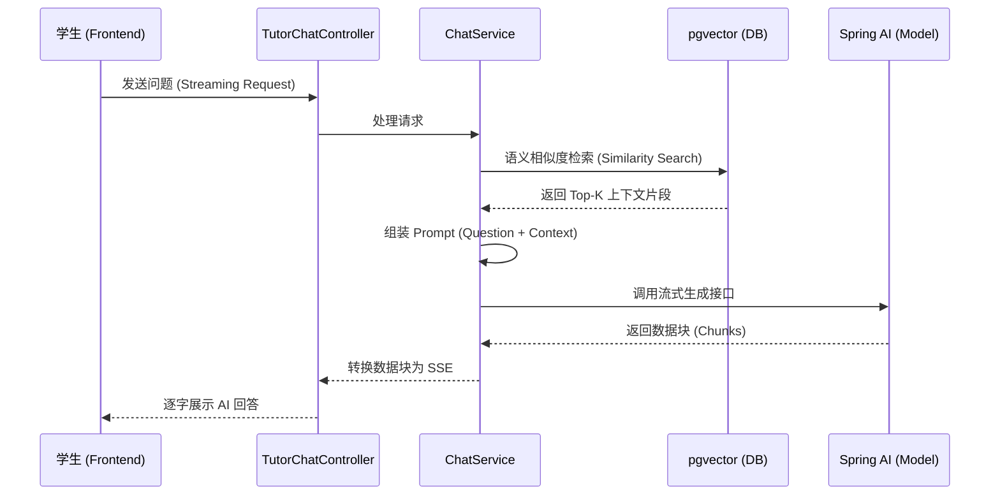
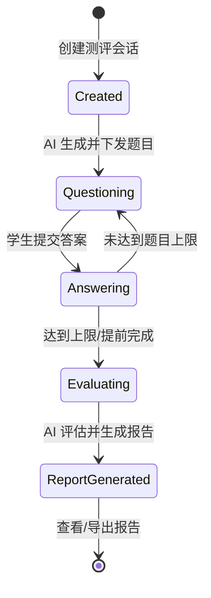

# AI-tutor 系统架构文档

## 1. 系统逻辑架构
使用 Mermaid 展现系统层级划分及组件交互：

```mermaid
graph TD
    subgraph Frontend [前端 UI 层]
        A[React App] --> B[Vite]
        A --> C[Tailwind CSS 4]
        A --> D[Recharts/Markdown]
    end

    subgraph Backend [后端服务层]
        E[Spring Boot 4.0] --> F[Spring AI 2.0]
        E --> G[Spring Data JPA]
        E --> H[Redisson/Redis]
        E --> I[Apache Tika/iText]
    end

    subgraph Infrastructure [基础设施层]
        J[(PostgreSQL + pgvector)]
        K[(Redis)]
        L[(MinIO / S3)]
        M[AI Model API - DashScope]
    end

    Frontend -- REST/SSE --> Backend
    Backend --> Infrastructure
```

## 2. 核心业务时序图 (以 RAG 问答为例)
展现从提问到流式返回的完整流程：

```mermaid
sequenceDiagram
    participant User as 学生 (Frontend)
    participant Controller as TutorChatController
    participant Service as ChatService
    participant Vector as pgvector (DB)
    participant AI as Spring AI (Model)

    User->>Controller: 发送问题 (Streaming Request)
    Controller->>Service: 处理请求
    Service->>Vector: 语义相似度检索 (Similarity Search)
    Vector-->>Service: 返回 Top-K 上下文片段
    Service->>Service: 组装 Prompt (Question + Context)
    Service->>AI: 调用流式生成接口
    AI-->>Service: 返回数据块 (Chunks)
    Service-->>Controller: 转换数据块为 SSE
    Controller-->>User: 逐字展示 AI 回答
```

## 3. 测评系统状态图
描述一次辅导测评的生命周期：

```mermaid
stateDiagram-v2
    [*] --> Created: 创建测评会话
    Created --> Questioning: AI 生成并下发题目
    Questioning --> Answering: 学生提交答案
    Answering --> Questioning: 未达到题目上限
    Answering --> Evaluating: 达到上限/提前完成
    Evaluating --> ReportGenerated: AI 评估并生成报告
    ReportGenerated --> [*]: 查看/导出报告
```
